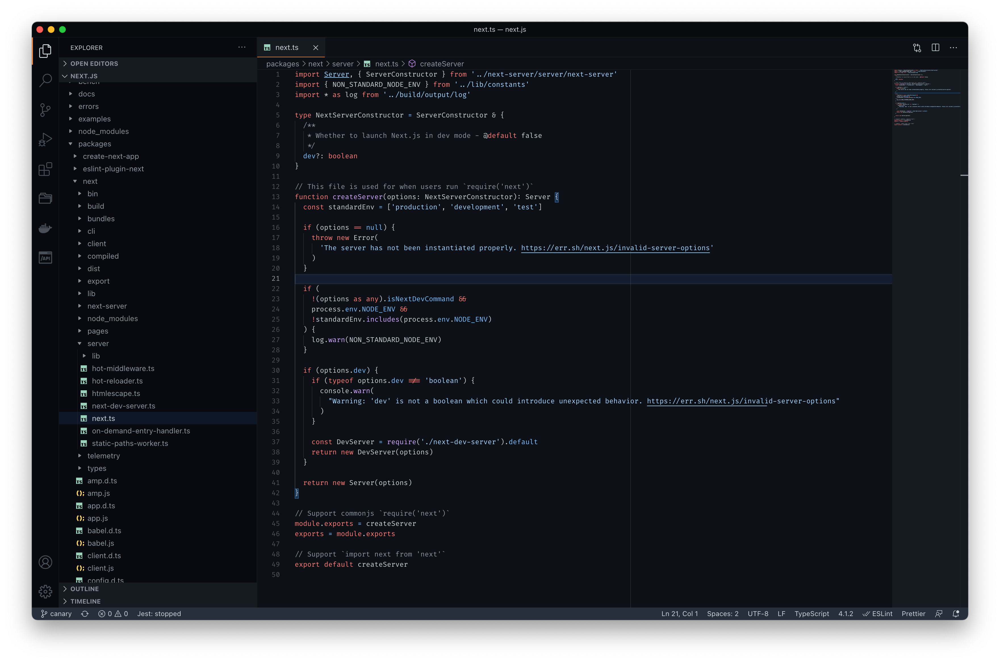

# GitHub Dark Mode

> GitHub Dark Mode theme for Visual Studio Code based on the actual CSS colors from [github.com](https://github.com).

## Install

1. Go to [Visual Studio Marketplace](https://marketplace.visualstudio.com)
2. Search for [GitHub Dark Mode](https://marketplace.visualstudio.com/items?itemName=markusylisiurunen.githubdarkmode)
3. Click on "Install"

## Development

If you want to contribute to this theme, you can run the theme locally by following these steps:

1. Clone this repository to your machine
2. Run `yarn` at the root of this repository
3. Start building the theme by running `yarn dev`
4. Press F5 on VSCode to start a new window using this theme

You can then make modifications to the theme and you should see your changes in real time.

### Updating the color palette

The GitHub colors are extracted from [github.com](https://github.com) using the script `scripts/scrape-github-colors.js`. To update the color palette, do the following:

1. Go to some repository in GitHub using Chrome
2. Open the development tools
3. Copy-paste the code from `scripts/scrape-github-colors.js` to the console
4. Paste the color palette to `src/github-colors.ts`
5. Make sure the colors are sorted alphabetically to make diffs clean
